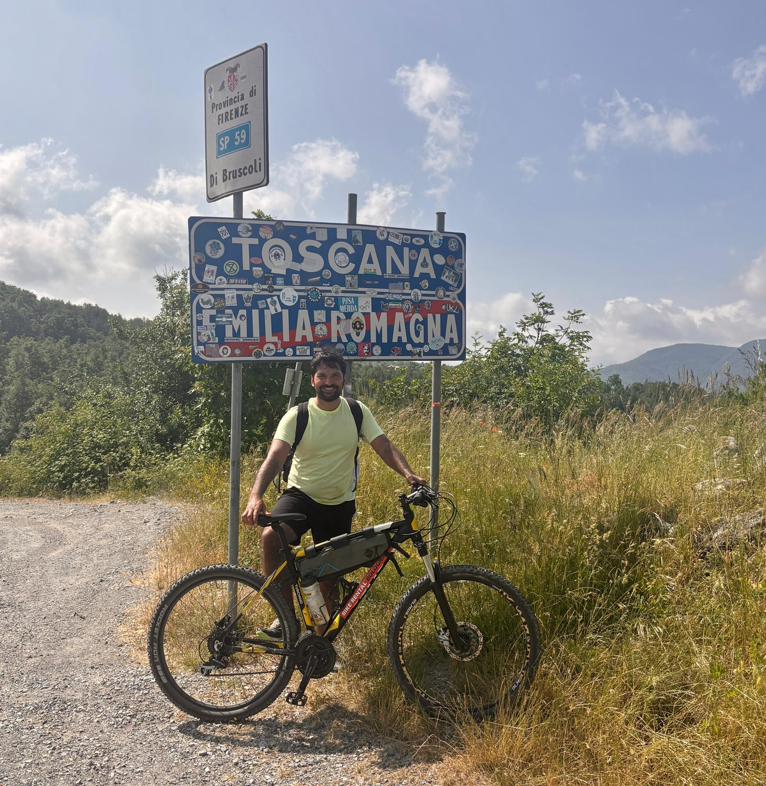

I’ve been moving quite a bit these past few years — from the streets of Marseille and the dunes of Morocco, to family visits in the UK, bike rides through Italy, long walks in in Dublin and long talks in Orlando, busy evenings in Pakistan and long drives in Brazil, and spiritual moments in Saudi Arabia. Each place left a trace. Not just on my passport, but in how I think, feel, and want to live my life.

## Balancing what matters

In Marseille, I was reminded that work can be both a blessing and a trap. Being involved is good — it gives purpose and energy. But I also saw how easy it is to lose sight of everything else when the mind never switches off. Weekends need to remain sacred. I need to protect the space where I’m simply *living*, not just *working*.

## Simplicity and gratitude

In Morocco, I rediscovered the beauty of simplicity. The red earth, the desert, the quiet — all of it whispered the same thing: “Less is more.” I felt grateful for what Allah has given me, blessed for the friends I have, proud of the path I’m on, and reminded that self-respect starts with self-love. Life is not meant to be rushed. Some truths are easier to hear under the open sky.

## What family means

In Orlando, seeing my sister standing strong in a new chapter of her life made me proud. In the UK and Brazil, being surrounded by family reminded me that no career, no job, no accomplishment comes close to the warmth of family. It’s the people who hold your hand during storms that truly matter. 

## Health, discipline, and humility

Italy, with its beautiful landscapes, reminded me how good it feels to be physically alive. Daily discipline — in food, movement, and rest — is not optional. It’s the base upon which everything else stands. In Dublin, the hardworking working class people working in cold and rainy weather paused me to appreciate the comfort we enjoy in our own homes. And being in Ethiopia brought me back to humility: to walk more, to eat better, to stay open-minded. The world is big. We are small. That’s not a sad thing — it’s freeing.

 
## Faith and limits

In Saudi, I remembered a line from Imam Ali: **Main nay apnay iradoon kay tootnay se Khuda ko pehchana.** Translated roughly into: I have known God through the breaking of my own plans. 

The fish can’t always see the ocean; it only knows the water it’s given. But the Provider knows the ocean. Trusting that is part of growing.
 

## Commitments that matter

Some lessons are practical — work with devotion, build better routines, travel more, stay healthy. 
But others are softer, deeper:
> *Be kind, not just nice.*
> *Keep your inner and outer worlds the same.*
> *Honor commitments.*
> *Don’t live to please others; live with heart.*
> *Involve Allah in your decisions.*

Travelling has a way of making everything clearer. The noise fades, and what remains are the few things that truly matter — faith, family, health, purpose, and gratitude.
The world is wide, but the things that anchor me are simple.
________________________________________