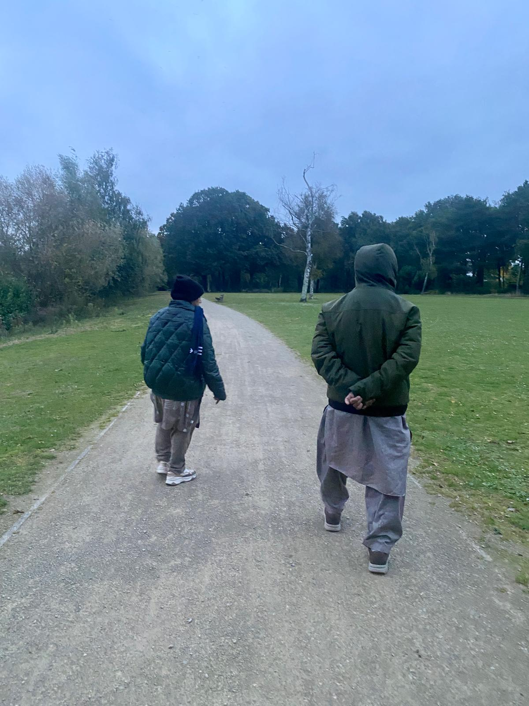
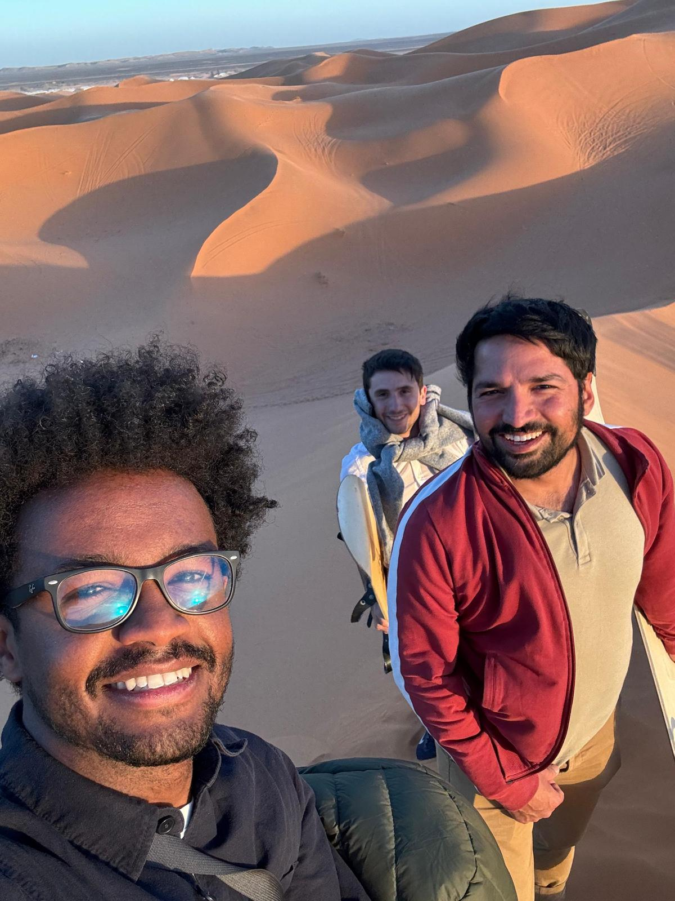

While an entire year has passed by since I posted [three takeaways from 2023](https://yawar5.github.io/website/posts/seventh-post/) covering the aspects of travelling, taking risk, having a positive attitude towards life, I find myself asking once again what the learning from this year (2024) are. So, with this post I would like to document them in following three takeaways (3Fs) from 2024. 

## 1st takeaway: Family.

With limited time on this planet, one’s family rightly should be among the central pillars when it comes to prioritising and dedicating one’s time in a prudent manner. Spending time with family members, helping and supporting them in hours of need, and actively ensuring that the family members are an integral part of our day to day lives is paramount not just our own well being but also paves the way for creating a compassionate society. 

While my parents visited me here in Europe for the first time in twelve years, I experienced the joy of simple things such as having breakfast together, visiting cities together and simple walks in the evening. This year reminded me that while we stay focused and determined in personal growth it is incomplete unless strengthening family bonds is part of that equation. Whatever your challenges might be when it comes to your specific case, ensuring that you strengthen your family bond from one year to another and dedicate enough time in a year to spend time together is a key takeaway for me from this year. 

## 2nd takeaway: Friends

We as human beings need anchoring and genuine counselling to make sense of the world. Friends are a true gift in this regard as they keep you in check and let you see things from different perspectives. Life becomes much more enjoyable and pleasant when shared with friends. This year reminded me the importance of old friends who know my journey and have repeatedly helped me through sound advice and continued to push me in becoming a better person.

As you grow old, you become stricter in your likes and dislikes and in some strange way less open to new friendships in your daily life. I have noticed this about myself when I am travelling, I am much more open to connecting with people and making new friendships and when I am busy with my day-to-day activities, I am somehow less open to new friendships. My takeaway from this year is not just to cherish old friendships and keep strengthening them but also to be more open in my daily routine to making new friendships. 

## 3rd takeaway: Fortitude

Allah states in Quran
> *We have certainly created man into hardship.(90:4)*   

Important is to face these hardships in faithful, firm and steadfast manner. 

Viktor Frankl a holocaust survivor in his book *Man’s search for meaning* beautifully articulates how finding meaning in tough conditions differentiate between life and death. 

The point I want to stress here is that hardships and ups and down are a necessary and natural part of life. Instead of dwelling upon them one should attempt to address them through fortitude and deal with others in a compassionate and kind manner.

Thank you all for your attention and a happy new year!
