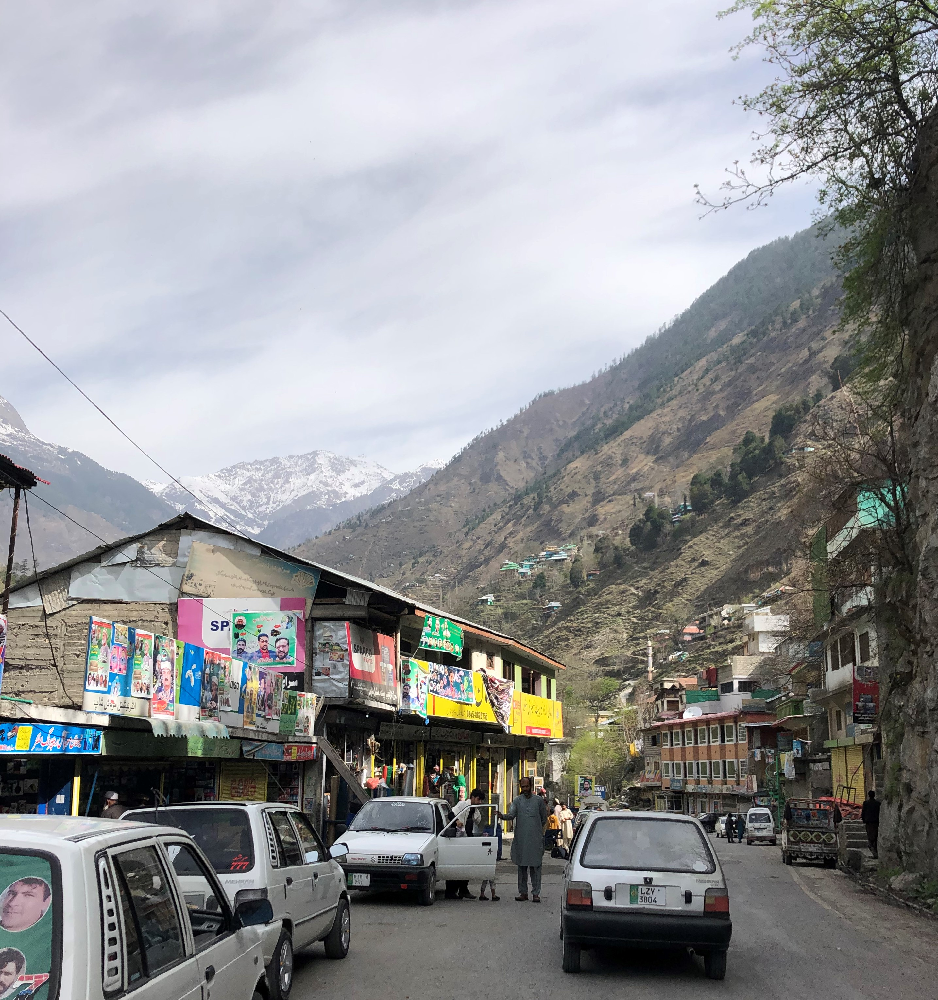
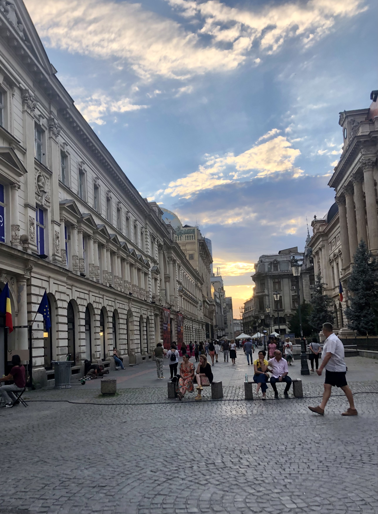

When our plane was about to land at Bucharest International Airport, I was full of all kinds of questions and prejudices about Romania. Having spent only four days in the country and travelled a little, I am filled with appreciation and admiration for this country. It is worth noting that I have seen this pattern repeat itself so many times: **we are filled with all kinds of wrong assumptions and prejudices about countries all over the world, but when we actually visit them, we are pleasantly surprised by their hospitality, openness and cultural values**. I have come to the profound realisation that materialistic development does not always guarantee hospitality and cohesion in a society and that today's world is a complex place from which we, as individuals, can learn a lot from each culture. 

> With this blog, I would therefore like to challenge you to take a different path when it comes to forming opinions and views about other countries. 
 
I will share with you some of my personal principles that I try to live by after having travelled numerous countries in the past ten years. I have developed these principles over the years, from the good old days when I was a broke student to the more financially prosperous days of being a PhD student. So let us begin:

## Principle 1: Form your own opinion instead of blindly believing what you hear from others

As I mentioned, today's world is more complex than we can comprehend. Each individual is a universe in itself. As we grow up, we tend to develop a keen sense of understanding of the people around us and the norms and traditions of our society. While it is always good to constantly check our beliefs and attitudes, it is especially important when we meet people from backgrounds that are foreign and unfamiliar to us. This is especially necessary since most of us have never been to these foreign countries and usually rely on rumours or opinionated reports in the media. I encourage you to form your own opinion by visiting those countries yourself or making friends with people from those countries. I am convinced that, in most cases, you will find that society's prevailing views on foreign countries are often inaccurate or rather present a very simple one-dimensional picture of a complex society. In order to get a better picture, I encourage you to travel more and form your own opinions as a result. 

## Principle 2: Try to immerse yourself in the local culture and way of life when travelling 

When I visit a new place, I try to get to know the culture and way of life of that place rather than having a relaxed and luxurious holiday. I believe that by immersing yourself in the local culture, you can experience the daily challenges upfront. You can also find new ways of solving problems by observing cultural solutions to different social problems up close. From the Danish 'Hygge' cafes to the cosy local tea stalls of Turkey, you can see how people comfort themselves and enjoy life on an ordinary day. 

## Principle 3: Seek help from local people rather than on the Internet

This principle is quite simple. By asking local people for directions to the city centre or asking for restaurant recommendations, you allow yourself to connect with locals. It's a mindset shift where you focus on being present in your surroundings rather than on the boring screens of your phone. In addition, you can not only experience people's hospitality and possibly make new friendships, but also hone your own communication and social skills.  

## Principle 4: Analyse the lifestyle of young and old, rich and poor people

Every society is composed of well-off people and those who struggle to afford the basic necessities of life. I encourage you to actively observe and analyse people's lifestyles when you travel. Try to recognise clear patterns between young and old and between rich and poor. More importantly, if you get the chance to discuss these patterns with the locals, even better. Ideally, all of us should live responsible lives and make a positive contribution to our society. But to do that, we need to develop an accurate understanding of the world. By analysing different societies as we travel, we essentially improve our understanding of the world, which leads us to act more responsibly within our societies. 

## Principle 5: Walk around the main areas of the city so that you have mapped it in your mind 

The last principle is meant to expand your existence in a metaphysical sense. When we are in a particular physical space, we are *PRESENT* there at that moment. By actually walking around the city and mapping the different streets and shops in your mind, you are living that presence. Another important benefit of this principle, apart from burning calories and staying physically fit, is that you learn to appreciate and value architecture and human development, despite all its shortcomings, which of course have to be addressed. 

## Conclusion

So there you have it, five principles that offer a new perspective on travelling and will help you not only to have a more meaningful travel experience, but also to get a more accurate picture of human society. I invite you to try them out next time you visit a new place and refine them according to your personal preferences. 

> My take-home message is this: Try to immerse yourself as much as possible in a culture or a society, observe and analyse the lifestyle of the people, seek help from the locals and experience their way of life, before you form a strong opinion about a human society