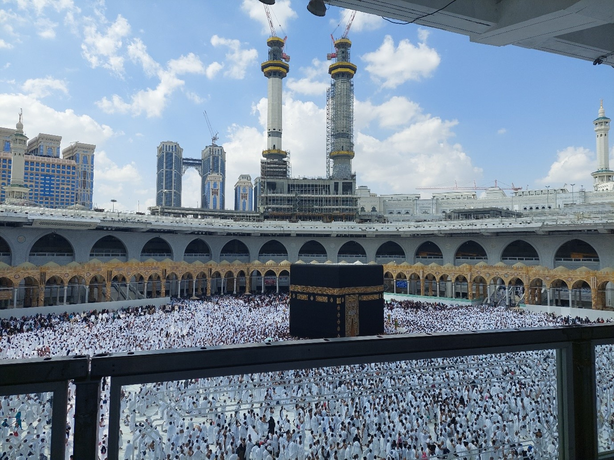
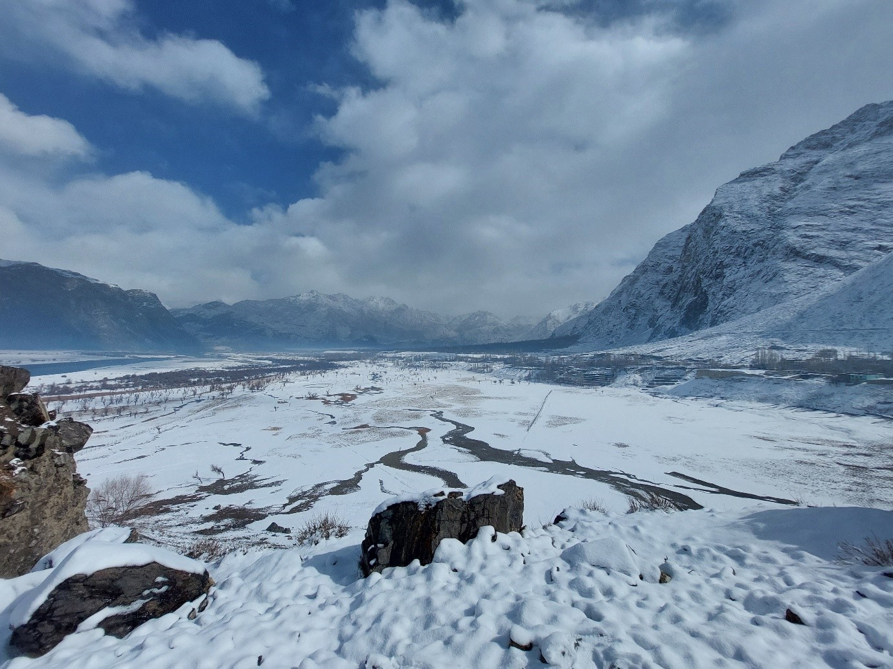
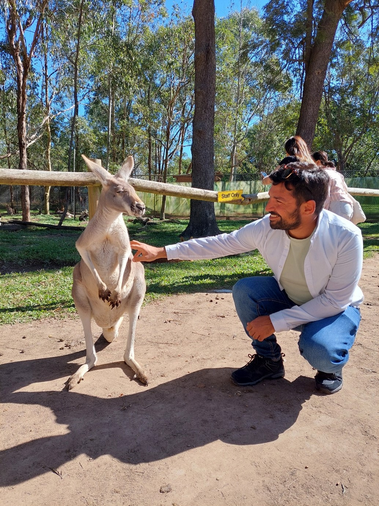
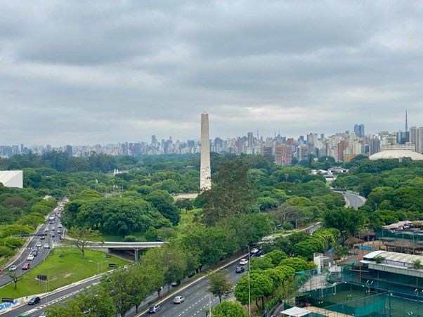
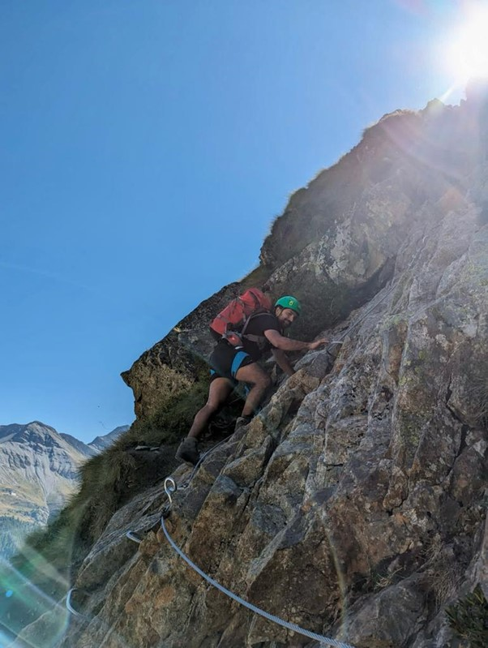
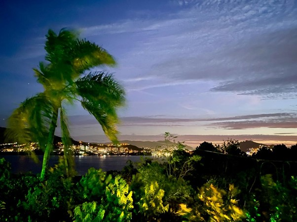

The last sun of 2023 will set in a few hours, and I would like to take this moment to reflect and capture some of the most important takeaways of the past year for me. If I had to describe this year in one word, for me it would be ‘Lively’. During the year it didn't seem that impactful, but looking back now, it feels like a lot happened in just one year. The focus here is on summarizing the year in three takeaways that may also be of interest to you (the reader). So let's begin.

## Takeaway #1: Traveling makes you realize how diverse and beautiful this world is, and it also makes you grateful for what you have.

In terms of travel, I was very blessed in 2023. It began with my visit to the holy sites of Mecca and Medina in Saudi Arabia while on my way to visit my parents in Pakistan. As a Muslim, it was a journey full of spirituality, peace and tranquility for me, which made me appreciate the bond of peace and love I share with all my fellow Muslims. On an individual level, it gave me a greater appreciation for all fellow human beings and inspired me to strive to bridge gaps rather than emphasize differences. 

This was followed by a family vacation in Northern Pakistan. I did not know which of my acts had pleased the Almighty, but I vividly remember how grateful I felt as I traveled with my parents and sisters through the beautiful and majestic landscapes of Northern Pakistan.

This was followed by a car trip with friends to Strasbourg in France, a conference trip to Sydney Australia, an overnight train trip to Vienna with JongNS board colleagues, a long weekend to Copenhagen to make important decisions, a hike in the Italian Alps, a long weekend in Salzburg and Stockholm and finally a conference visit to Brazil.

Looking back, I feel so blessed and grateful to have had the opportunity to visit and experience all these amazing places. But the question to ask is: what did I learn from all that traveling? As far as I understand it, I learned to seek adventure in life and connect with people. By striving for something, working hard to achieve it and reaching out to people, you realize that most of the limitations we experience in our lives are a product of our own minds. The lesson I learned from this is that I must continue to travel in the coming years with the goal of experiencing different cultures and building connections.

## Takeaway #2: Life shrinks or expands in direct proportion to your willingness to take risks.

Life and death are a natural phenomenon. As mentioned earlier, during my visit to Brazil, I was truly filled with admiration for the beautiful landscape of Brazil and the hospitality of the Brazilian people. I was excited when I was headed there, but I was filled with love for the country by the time I took my flight back to Europe just 9 days later. If I had decided not to write that conference paper because it wasn't necessary, if I had decided not to go because, unlike previous conferences, I had to pay all expenses myself, or because I didn't know the place, the language and the culture, my understanding of life would never have been enriched. Just the fact that I chose not to let these potential risks keep me from pursuing what inspired me caused me to expand my understanding of life. One certainty we all have in life is that we will all leave this world when the time comes. So why not expand our lives by taking risks and looking for things that inspire us, while of course making sure we take general precautions.

One other personal example is the professional career switch I made in 2023. Switching from NS to ASML, while working within the rail industry for the last five years, meant I had to let go of familiarity and choose to step outside my comfort zone. It could have gone wrong, I could have listened to all the mental reasons why I should not make this switch, such as familiarity with colleagues, job security, work-life balance, etc. But the truth is that I didn't know much about ASML at that time. The decision had to be made as a leap of faith and with a view to further personal growth. And although I am at the beginning of the journey, the life experience has become significantly richer and I am certainly grateful to have been offered this opportunity and happy to have taken this risk. The lesson I have learned is that I must continue to ignite the spark of challenging myself and taking risks in the years to come.

## Takeaway #3: It's better to focus on the glass half full than the glass half empty.

One of my core values, that comes partly from nature and partly from nurture, is positivity. It's true that keeping an eye on what can go wrong and having an action plan on how you're going to handle the situation if things go wrong saves you from a lot of problems, whether it's vacation planning or trusting people in general. I have come to realize that staying positive, seeing the good in people, choosing to admire rather than criticize, can go a long way in guiding us through life. Everyone is fighting their own battle and my experiences over the past year have repeatedly taught me not to jump to conclusions and to take the time to first seek understanding and then be understood. Whether in professional or family matters, real-life problems can be quite complex and not always black and white. Staying positive can help you weather many storms and inspire you to be a pillar of support for many shaky roofs. The lesson I learned from this is to cherish the positive attitude I have and use it to chart my future path.

These are the three takeaways I had from 2023. Thank you for your attention and I wish you a happy, healthy and memorable 2024.
