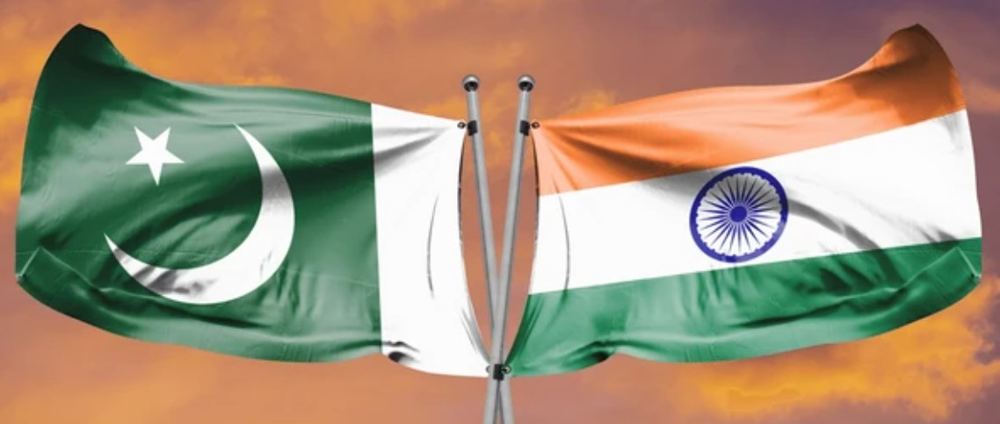

# Introduction: Home Beyond Borders

As I stood on my balcony in the Netherlands on a quiet Saturday evening, the sun warmed my skin while my thoughts drifted to Pakistan.

Born and raised there for 20 years before studying in Italy and building a life in the Netherlands, I’ve come to understand that *“home”* is not one place—it’s layered. And while I may now live across continents, Pakistan will always live in me.

These years abroad have added perspectives, but my moral compass—shaped by my culture, faith, and people—still points to where I came from. That’s what gives me clarity when I reflect on moments like the recent escalation between India and Pakistan. At the core of it, I would like to share some thoughts on this conflict and draw your attention to the following quote:

> “Peace cannot be kept by force; it can only be achieved by understanding.”  
> — Albert Einstein

I will touch on the themes of the manipulative power of media, roots of conflict, human cost and empathy, and a call for piece and dialogue. So lets begin:
---

# The Distorting Lens of the Media

In the digital age, news travels fast—but not always deep. Every few seconds, we’re bombarded with updates. The brain tries to keep up, but clarity often drowns in noise.

What’s worse: media narratives aren’t neutral. Depending on what you consume—Pakistani, Indian, or international—you’re led to completely different conclusions. And in that tug-of-war for clicks and political points, truth and humanity suffer. It is important to be aware of this phenomenon and consume news with a pinch of salt.

> “Our ability to reach unity in diversity will be the beauty and the test of our civilization.”  
> — Mahatma Gandhi

---

#  Historical Roots and the Responsibility of Legacy

India and Pakistan—siblings in geography and history—have walked separate paths since 1947. But the shadow of Partition and the unresolved issue of Kashmir still haunt the region.

When India revoked Article 370 unilaterally, it triggered resentment and resistance. That reaction was human—and predictable. Suppressing voices breeds unrest. And yet, those in power often forget: the land doesn’t just belong to governments—it belongs to people. And it is dialogue and diplomacy that settles such issues not force and voilence.

> “An eye for an eye only ends up making the whole world blind.”  
> — Mahatma Gandhi

---

# Human Cost and the Dignity of All People

There’s one truth that should rise above all political noise: on both sides of the border, there are people who love their land, cherish their families, and want peace.

Especially in regions like Kashmir, Punjab and Sindh, the shared language, values, and humor remain. These aren’t just opposing nations—they are neighboring communities with intertwined souls.

And yet, in times of tension, common people are forced into enemy roles—by politics, not by will. For such interwined souls solution lies in non-voilence and dialogue and not in voilence and force. 

> “Nonviolence is a powerful and just weapon which cuts without wounding and ennobles the man who wields it.”  
> — Martin Luther King Jr.

---

# Wisdom and Strength in Response

Two weeks ago, a horrific attack in Kashmir left innocent tourists dead. That act was wrong and deserves condemnation, full stop.

But what followed—an airstrike, retaliation, blame, escalation—threatened to spiral. Not because one side is always wrong or the other always right, but because both were reacting from pain, pride and pressure.

Let’s be clear: when a nation’s honor, dignity, or land is threatened, it must stand up. There is strength in defending what’s sacred. And for many of us especially Muslims, the words *“la ilaha illAllah”* are not just a statement of faith—they are a source of unshakable resilience, strength, and dignity.

Yet, strength is not the opposite of peace. Strength is choosing dialogue when violence is easy. Strength is standing firm without losing compassion. And lets remember that:

> “Darkness cannot drive out darkness; only light can do that. Hate cannot drive out hate; only love can do that.”  
> — Martin Luther King Jr.

---

# Conclusion: A Shared Duty to Rise Higher

Peace is not weakness. It is wisdom. It is the recognition that despite our flags and differences, we are sons and daughters of the same soil.

We do not forget history, and we do not ignore the risks. But we aim higher—not because we fear conflict, but because we know the weight it carries. True courage is not in conquest, but in building a future that does not need war to define it.

When I heard of the recent ceasefire, I felt a deep, quiet relief. Not just because bloodshed paused, but because it reminded me: dialogue is still possible.

> “Peace begins with a smile.”  
> — Mother Teresa

So let us defend peace like we would defend our homeland. Let us stand with dignity, fairness, and strength. And let us remember that wisdom and courage are not opposites—they are allies. 

I want to end by a profound quote from Prophet Muhammad ﷺ that beautifully reflects the spirit of this blog:

“Shall I not tell you what is better than fasting, prayer, and charity?”
“It is reconciling between people. Verily, spoiling relations is the shaver (i.e., destroys faith).”
— Prophet Muhammad ﷺ (Sunan Abi Dawud 4919, Hasan) 

---

*Thank you for reading. I welcome your thoughts and reflections.*
